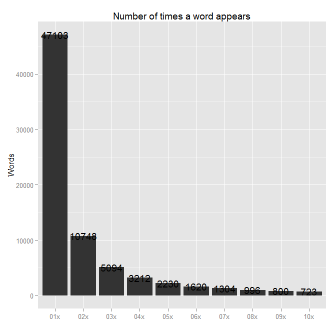

### Summaries of the Three Original Datasets

Source          | Number of Lines | Number of Characters | Characters per Line
------          | --------------- | -------------------- | -------------------
NEWS Dataset    | 77,259          | 15,683,765           | 203.0
BLOGS Dataset   | 899,288         | 208,361,438          | 231.7
TWITTER Dataset | 2,360,148       | 162,384,825          | 68.8

### Sample Line Extract from the Three Original Datasets

#### News (line 50067)

* The son of a colonel in the U.S. Army, Thompson missed a crucial football recruitin period last spring to be with his family in South Korea, where his father was stationed. After about six months overseas, Thompson returned to Virginia and earned his first scholarship offer from Maryland, which he accepted soon after. As a senior, Thompson made 75 tackles (35 solo), including five sacks and 2.5 tackles for loss. He also contributed two interceptions (one returned for a touchdown), one forced fumble and one fumble recovery. \"He‚???Ts an extremely solid competitor,\" said Grassfield coach Martin Asprey. \"He doesn‚???Tt like to fail. ... He‚???Ts got great range, he can run very fast and he‚???Ts got the height, too.\"
 
#### Blog (line 800155)                                                                                                                                                                                                                                                                                                                                                                                                                                                                                                                                                                                                                                                                                                                                                                                                                                                                                                                                                                                                                                                                                                                                                                                                                                                                                                                                                                                                                                                                                                                                             

* I have one little girl in my class who is pretty funny. The other day she asked me for a ‚???omooch and a hug.‚???ù The thing is she talks at warp speed so it kind of sounds like, ‚???oamoochanahug.‚???ù I had to ask her 3 times what she meant! She was getting frustrated with me, so she finally just gave me a kiss on the cheek (a ‚???omooch‚???ù) and a hug. She‚???Ts a real cutie too. I wish you could hear the way she says, ‚???oheart.‚???ù It sounds more like, ‚???ohout.‚???ù She‚???Ts always good for saying funny things, so this week I‚???Tm featuring tiny talk by Susie (her name is not really Susie, but you know‚???¶I have to call her something and protect her privacy.) So Susie it is!

#### Twitter (line 10087)

* Yes, magical realism. Who knows,maybe the next cup I brew will transport me to a neon planet that rains tea & crumpets!

#### Notes
* The three datasets collectively cover a wide range of writing styles and topics.
* Each "line" can actually be comprised of multiple sentences.
* Punctuation and random characters embedded within the text (She‚???Ts) need to be accounted for. 

### Combined Dataset Preliminary Analysis

Most Frequent Words

* and
* for 
* that
* the
* with
* you

Some of the Least Frequent Words

* rudimentarily
* Creeeeeeeeeeek 
* losangelesartist
* complexifiers
* muahahahahahahahahaahaaaaaha
* zoologico

The most frequent words are as expected - simple words that would show up in a range of different contexts.  The least frequent words show the unique qualities of this particular dataset.  Some of the words on this list are real English words which are not used often in everyday speech, like rudimentarily.  Others are words borrowed from other languages which have shown up in the English dataset -- zoologico is Spanish for zoo.  Still others, like losangelesartist, are several words compounded together.

One feature of a successful prediction algorithm is to focus its attention on relatively common words in favor of less common words.  A rule which sees that you have written "I have many tricks up my sleeve" and suggests you write: "muahahahahahahahahaahaaaaaha", is not going to be particularly useful unless you are a magician who has a reputation for lacking in subtlety and tact.

#

This plot shows that the dataset with minimal data cleansing has 47,103 unique words (words that appear only once in the entire dataset). This is a considerably high number, and suggests additional data cleansing is to be done before an efficient prediction algorithm can be developed. 

### Next Steps

1. Develop frequency tables of all two-word (bigram) and three-word (trigram) combinations
2. Apply smoothing techniques to frequency tables to account for rare words, which do not appear in the dataset but would still be valid word predictions
3. Write function that takes a word as input and outputs word with highest probability 
4. Build function into Shiny app 